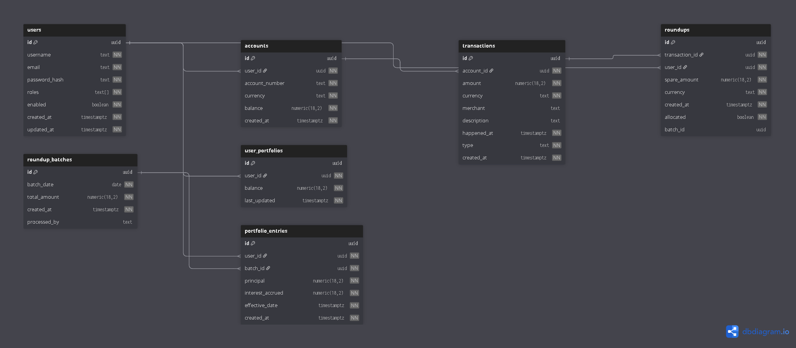

# **Fintech Wallet – Round-Up Investment Platform**

## **Overview**

The **Fintech Wallet** is a Spring Boot-based application that allows users to:

* Create accounts and manage balances.
* Automatically "round up" spare change from transactions.
* Invest accumulated round-ups into a portfolio.
* Track all transactions and portfolio growth in real time.

This project demonstrates **backend development mastery** using **Spring Boot**, **PostgreSQL**, and **REST API best practices**.
It’s designed to simulate a real-world fintech product that could be deployed in production.

---

## **Features**

* **Secure User Management**: JWT-based authentication for user registration and login.

* **Transaction Ingestion**: RESTful endpoint to accept and store user transaction data.

* **Automatic Round-Up Savings**: Automatically calculates and saves the spare change from every transaction.

* **Simulated Portfolio Management**: A weekly scheduled job aggregates round-ups and applies a simulated 1% interest to grow the user's portfolio.

* **Dynamic API**: Supports pagination, sorting, and filtering on key endpoints.

* **Admin Capabilities**: Secure endpoint for administrators to trigger processing jobs manually.

* **Self-Documenting API**: Integrated Swagger/OpenAPI for interactive API documentation.

* **Containerized**: Fully containerized with Docker and Docker Compose for easy setup and deployment.

* **Automated CI/CD**: A GitHub Actions pipeline automatically builds, tests, and publishes a Docker image on every push to main.

---

## **Tech Stack**
- **Language**: Java 21

- **Framework**: Spring Boot 3 (Web, Data JPA, Security, Scheduling)

- **Database**: PostgreSQL

- **Build Tool**: Maven

- **API Documentation**: springdoc-openapi (Swagger UI)

- **Containerization**: Docker, Docker Compose

- **CI/CD**: GitHub Actions

---

## **Database Schema**


*(See `src/main/resources/data.sql` for full schema.)*

---

## **API Endpoints**

Base URL: `http://localhost:8080/api/`

For complete API details, run the application and visit:

```
http://localhost:8080/swagger-ui.html
```

---

## **Installation & Setup**

### **1. Clone the repository**

```bash
git clone https://github.com/modhtom/fintech-wallet.git
cd fintech-wallet
```

### **2. Configure PostgreSQL**

* Install PostgreSQL (if not already installed).
* Create the database:

```bash
createdb fintech_wallet
```

* Update `src/main/resources/application.properties` with your PostgreSQL credentials.

### **3. Run Database Scripts**

```bash
psql -U postgres -d fintech_wallet -f src/main/resources/schema.sql
psql -U postgres -d fintech_wallet -f src/main/resources/data.sql
```

### **4. Run the application**

```bash
mvn spring-boot:run
```
---

## TODO
- Email notifications for investments
- Integration with real bank APIs
---


## **License**

This project is licensed under the MIT License.
